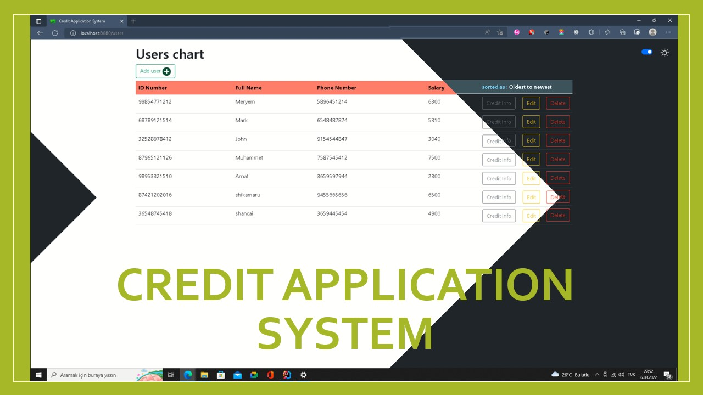
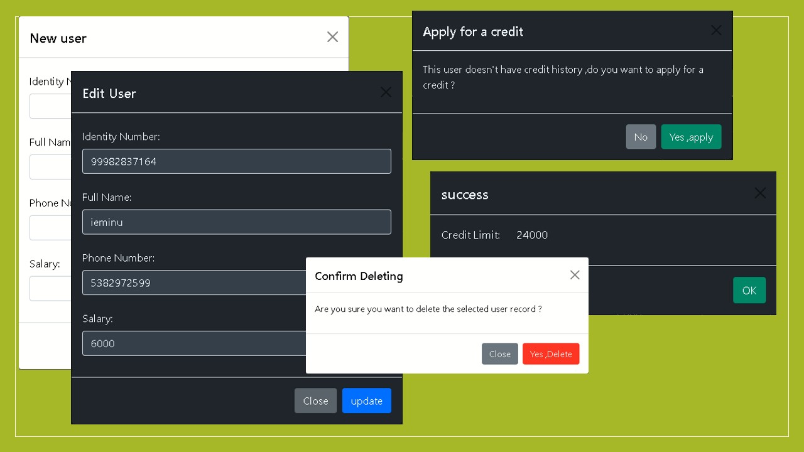

# Credit Application System
this app is made for handling costumers who assumed to withdraw a credit
from the bank ,so It's calculating their budget and whether they can  return the amount or not
(in this app that calculation are made according to the ID card number's last digit just to not have a strategy to do that
and to simulate the reality I also made the ID numbers that end with odd digit INVALID numbers)

## How to use
- add a user from the button at the Up_Left corner adding their name ,identity number ,phone number and salary.
- edit a user by clicking on *Edit* button from It's relevant line. 
- delete a user by clicking on *Delete* button from It's relevant line.
- show the user credit info by clicking on *Credit Info* button 
- if the user doesn't have applied, yet we can apply from the same button ,a window will pop up to make us do that
- additionally we can change background_mode by clicking on the switcher at the Up_Right button

the windows are like :

