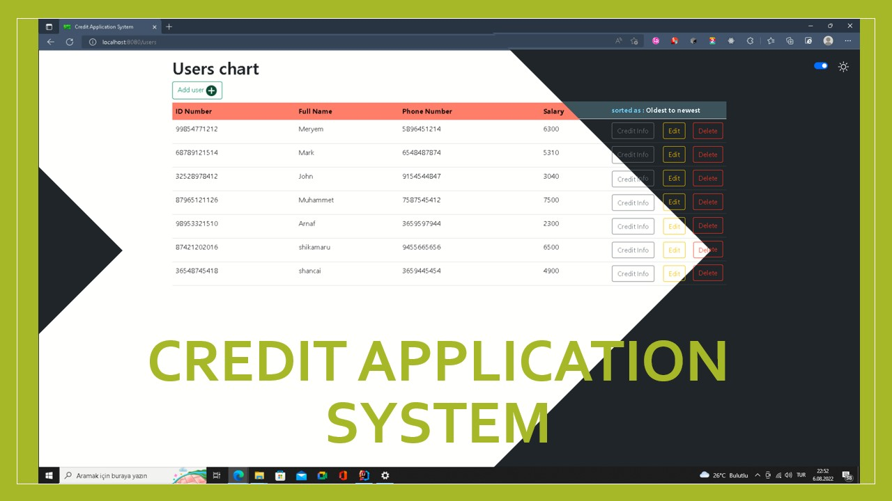

### the final project details:

# Credit Application System
this app is made for handling costumers who assumed to withdraw a credit
from the bank ,so It's calculating their budget and whether they can  return the amount or not
(in this app that calculation are made according to the ID card number's last digit just to not have a strategy to do that
and to simulate the reality I also made the ID numbers that end with odd digit INVALID numbers)

the windows are like :

the usage of the application is described in the original folder's [README file](CreditApplicationSystem/README.md).
