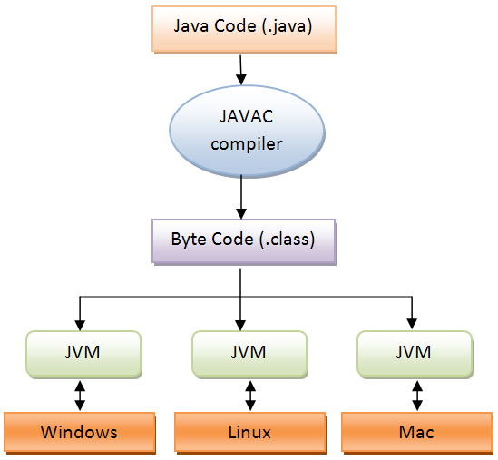
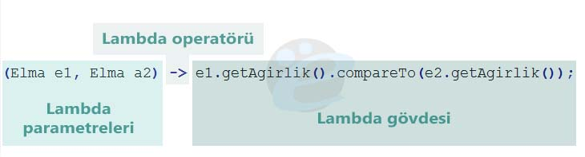
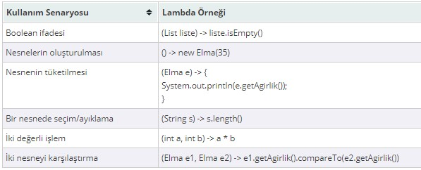

# JVM (Java Virtual Machine - Java Sanal Makinesi)

bazı türkçe kaynaklarda ``JSM`` olarak ifade edilir &nbsp;(Java Sanal Makinesi)


 ## JVM nedir ve nasıl çalışır


java programları derlendikten sonra bilgisayrın anlayacağı dile dönüştürülür ,
Buna `ByteCode`
 denir.
 ByteCode ile java programlarının platformdan bağımsız çalışması sağlanır.
 ByteCode bir kere oluşturulur ve her işletim sisteminde çalışır , Buna ``write once run everywhere`` de denir ,
 Bunu sağlayan yapı ``JVM``'dir.<br>
 Java programlarının çalışma mantığını daha detaylı bir şekilde anlatalım.

 Java programları sınıflardan oluşur,yazılmış olan sınıfların bulunduğu dosyaların uzantısı  *``.java``* 'dır , Bu  *``.java``* uzantılı dosyalar , Bir derleyici yardımıyla derlenir ve ``ByteCode`` adı verilen makine kodlarına dönüştürülür. <br>
 Artık bu dosyanın uzantısı *``.class``* olmuştur. Bu işlem yalnızca bir kez yapılır. Bu *``.class``* uzantılı Byte Kodlar , JVM yardımıyla her işletim sisteminde çalışır hale gelmiştir.
 JVM , Bu byte kodları adım adım yorumlar , yazılan java programlarının diğer işletim sistemlerinde de çalışabilmesi için o makinede JVM kurulu olması gerekir . Hazır olan byte kodları , O makine üzerinde yorumlayarak işletim sisteminin kullanımına sunar. Böylece byte kodlarıi üzerinde çalıştığı sisteme uygun hale getirir, Günümüzde neredeyse her platform için yazılmış JVM'ler bulunmaktadır.
 ***
 ## JVM mimarisi

 

 ***
## Java 8 ile birlikte gelen JVM mimarisindeki değişiklikler

 Java platformunun 'Java SE 8' sürümü, 18 Mart 2014'te yayınlandı. <br>
JDK 8'in [Yeni özellikleri](https://www.oracle.com/java/technologies/javase/8-whats-new.html)nin en yararlı ve ilginç olanları şöyledir : 

* Lambda ifadeleri
* Koleksiyonlarla çalışmak için Stream API
* CompletableFuture İle eşzamansız görev zincirleme
* Yepyeni Time API

  [**Lambda ifadeleri**](http://omereryilmaz.com/java-lambda-nedir/)

 Java, nesne-yönelimli programlamanın (object-oriented programming)  yazılım geliştirme için temel paradigma olduğu 1990’lı yıllarda nesne-yönelimli  bir programlama dili olarak tasarlanmıştır. Nesne-yönelimli programlamadan çok önce Lisp ve Scheme gibi fonksiyonel programlama dilleri olmasına rağmen akademik çevreler dışında pek rağbet görmemiştir. Son zamanlarda da fonksiyonel programlama önem kazanmıştır çünkü eşzamanlı ve olay güdümlü programlama için bu yöntem çok uygundur. Ama bu, nesne-yönelimli programlamanın kötü olduğu anlamına gelmemektedir. Aksine nesne-yönelimli programlamayla fonksiyonel programlamanın harmanlanması bu konuya daha da işlevsellik kazandırmaktadır. Örneğin programlama dilinin işlevsel ifadeler için uygun bir söz dizimi (syntax) varsa koleksiyon kütüphaneleri güçlü API’ler sunabilir. Java 8 ile gelen temel değişiklik fonksiyonel programlama yapılarının nesne-yönelimli yapının köklerine eklenmesidir [[1]](http://www.drdobbs.com/jvm/lambda-expressions-in-java-8/240166764).

Lambda ifadeleri de Java 8 ile birlikte gelen en büyük yenilik olarak görülmüştür. Ana amacı fonksiyonel programlamayı kolaylaştırarak kod geliştirmeyi veya yazmayı daha sade ve basit hale getirmeyi sağlamaktır [[2]](https://www.tutorialspoint.com/java8/java8_lambda_expressions.htm). Bir lambda ifadesi anonim bir fonksiyonun kısa bir şekilde gösterimi de diyebiliriz. Bir isme sahip değildir ancak parametre listesine, bir gövdeye ve bir dönüş tipine ayrıca da fırlatılabilecek istisnaların (exceptions) bir listesine sahiptir. Bu tanımı biraz daha anlaşılabilir olması adına açacak olursak;

Anonimdir dedik çünkü bir metodun normalde sahip olacağı gibi belirgin bir isme sahip değildir.
Fonksiyondur dedik çünkü bir lambda belirli bir sınıfla bir metod gibi ilişkili değildir. Ancak bir metod gibi parametre listesi, bir gövdesi, bir dönüş tipi ve muhtemel fırlatılabilecek istisna listesine sahiptir.
Bir lambda ifadesi bir metodda argüman olarak geçirilebilir veya bir değişkende depolanabilir.
Yazımı kısadır, anonim sınıflar gibi basmakalıp uzun bir yazımı yoktur.
Sonuç olarak kodumuzun daha net ve esnek olmasını sağlar. Örneğin lambda ifadesi kullanarak daha kısa bir şekilde özel bir Comparator nesnesi oluşturabilirsiniz.

Önce :

```java
Comparator<Elma> agirlikOlarak = new Comparator<Elma>() {
public int compare(Elma e1, Elma e2){
return e1.getAgirlik().compareTo(e2.getAgirlik());
}
};
```
Sonra (lambda ifadesiyle):

```java
Comparator<Elma> agirlikOlarak =
(Elma e1, Elma a2) -> e1.getAgirlik().compareTo(e2.getAgirlik());
```
Yukarıdaki kodların her ikisinde de Elma sınıfından üretilen nesnenin ağırlıkları karşılaştırılmaktadır. Görüldüğü üzere lambda ifadesi kullanılarak kod daha anlaşılır ve kısa hale getirilmiştir.


Şekil 1. Bir lambda ifadesi parametrelereden, bir ok şeklinden ve bir gövdeden oluşmaktadır.

 ``Parametre listeleri :``
 Buradaki iki “Elma”nın parametreleri, bir Comporator karşılaştırma metodu ile karşılaştırılır.
Lambda operatörü : Parametre listesini lambda’nın gövdesinden ayırır.
Lambda gövdesi : İki “Elma”nın ağırlıkları burada karşılaştırılır. Karşılaştırma sonucu da lambda’nın dönüş değeri olarak düşünülür.


Bu şekildeki lambda syntax’ı Java tasarımcıları tarafından, C# ve Scala gibi benzer özellikleri taşıyan dillerde başarılı olduğu için seçilmiştir. Yukarıda da anlatıldığı üzere temel syntax;

(Parametreler) -> ifade

Veya

(Parametreler) -> { ifadeler; }

<br>
 ``Lambda örnekleri :``

 

&emsp;&emsp;[**Koleksiyonlarla çalışmak için Stream API**](https://bilisim.io/2017/01/29/java-8-stream-api/)

 Günümüzde büyük verinin işlenmesi açısından, işlerin küçük parçalara ayrılıp paralel işlenmesi önem kazanmıştır. Bu işlemi dağıtık bir şekilde yapan frameworkler yazılmakta ve kullanılmaktadır. Javanın, 8 versiyonu da büyük veri işleme yaklaşımlarını ve sektörün yeni gereksinimi olan büyük işlerin küçük parçalar halinde eş zamanlı işlenmesini karşılamaya çalışmasının bir ürünüdür.  Stream API de bu cevaplardan birini oluşturur.

Stream, javanın bir kaynak içerisindeki elemanları paralel veya sıralı işlenmesini kolaylaştıran, geliştiriciyi elemanları işlerken oluşturacağı bir çok koşul ve döngü ifadelerinden kurtaran güzel ve kullanışlı bir yapıdır. Stream oluşturulup işlendikten sonra tekrardan işlenemez. Yeniden stream’in oluşturulması gerekir.

Stream oluşturmanın bir kaç yöntemi vardır.

* Koleksiyonlardan:

Java 8 ile, interface’ler default metota sahip olabilmektedir.  Collection interface’i de stream oluşturan metot aracılığı ile, List vb koleksiyonlardan stream oluşturabiliriz.
```java
List<Integer> numbers = Arrays.asList(1,4,2,10,8);
Stream<Integer> numberStream = numbers.stream();
```
* IntStream, DoubleStream, LongStream interfaceleri ile:
```java
IntStream.range(0, 10).forEach(System.out::println);
IntStream.rangeClosed(0, 10).forEach(System.out::println);
```
* Stream Interfacei ile:
```java
Stream.of("Stream","Olustu").forEach(System.out::println);
```
Stream üzerinde yaptığımız işlemler intermediate ve terminal olmak üzere ikiye ayrılır. Her iki işlem arasındaki temel farklar:

* Intermediate işlemler lazy’dir. Terminal işlemi çağrılana kadar, çalışmazlar. Terminal işlemler çağrıldığı anda çalışırlar.

* Intermediate işlemler ile zincir halinde metotlar ile stream’i işleyebiliriz. Buna pipeline denir. Terminal işlemler ile bu yapılmaz.

* Intermediate işlemler geriye başka bir stream döner. Terminal işlemler dönmez.

  [<span style="color:#ddffbb; font-size: 16pt;">CompletableFuture İle eşzamansız görev zincirleme
</span>](https://kodedu.com/2014/11/java-8-completablefuture-ile-asenkron-programlama/)

CompletableFuture sınıfı, Java 8 içerisinde asenkron operasyonlar için özelleştirilen bir sınıftır. Java ortamında Java SE ve Java EE teknolojilerinde bir çok asenkron programlama imkanı halihazırda geliştiricilere sunulmaktadır. CompletableFuture sınıfı ise, asenkron programla ihtiyaçlarına çok daha genel çözümler getirmektedir.
 ### Syncronous vs. Asyncronous

Eğer bir uygulamanın akışında, bir görevin başlaması diğer görevin bitişine bağlı ise, buna senkron programlama; Eğer bir görevin başlaması diğer görevin başlamasına engel olmuyorsa da asenkron programlama kavramları ortaya çıkmaktadır. Java programlama dili asenkron programlamaya çoğu noktada imkan sağlamakla birlikte, dilin genel yatkınlığı çoğu dil gibi senkron programlama yönündedir. Fakat, örneğin JavaScript gibi bir dili incelediğinizde, asenkronitinin dilin diyaznını ne derece etkilediğini gözlemleyebilirsiniz.

Örneğin, elimizde ``fetchFromDatabase``
 ve ``saveFiles``
  metodları olduğunu varsayalım. İlk metodun koşturulma süresi 5, diğerinin ise 3 saniye alıyor olsun.
```java
private List<String> fetchFromDatabase(){
   ...
       Thread.sleep(5000);
   ...
}

private List<byte[]> readFiles(){
   ...
       Thread.sleep(3000);
   ...

}
```
Şimdi bu iki metodu peşisıra koşturalım.
```java
fetchFromDatabase();
readFiles();
```
Bu iki görevin tamamlanma süresi ne kadar olacak?<br>
``cevap:``
```java
 Math.sum(5,3) = 8
 ```

 Java dilinin genel doğası gereği bu iki iş sırasıyla işletilecektir. Fakat dikkat edilirse, yapılan iki iş birbirinden tamamen bağımsızdır. Biri DB’den veri çekiyor, diğeri ise dosyalama sisteminden dosya okuyor. Dolayısıyla, bu işlerden birinin başlaması için diğer işin tamamlanması beklenmek zorunda değil.

Bu iki metodun asenkron olarak çalışması için geleneksel çokişlemcikli programlama ile harici asenkron iş kolları oluşturulabilir. Fakat, burada geleneksel yöntemlerin dışında CompletableFuture nesnesi üzerinden gitmekte fayda görüyorum.
```java
public class CompletableFuture<T> implements Future<T>, CompletionStage<T> {
    ...
}
```

``CompletableFuture`` sınıfı ``Future`` ve ``CompletionStage`` arayüzleri türünden jenerik bir sınıf. ``CompletableFuture`` türünden nesneler, nesnenin yapılandırıcısı üzerinden veya ``CompletableFuture`` ‘nin çeşitli statik metodlarıyla oluşturulabilmektedir.

``CompletableFuture`` ile doğası senkron koşmak olan bir işi, asenkron koşar hale getirebilirsiniz. Aslında yapılan iş, senkron koşan işin arka plana itilerek koşturulması ve mevcut program akışının kesintiye uğratılmamasıdır. ``CompletableFuture`` nesneleri, ekstra olarak tanımlanmadığı sürece tek bir ForkJoin Thread havuzu ile işlerini asenkron olarak arka planda koşturmaktadır.

Şimdi yukarıdaki senkron örneği asenkron hale getirelim. Bunun için ``CompletableFuture`` ***``runAsync``*** metodu kullanılabilir.
 ```java
 public static CompletableFuture<Void> runAsync(Runnable runnable) {
        ...
   return f;
}
 ```
 ``CompletableFuture`` ***``runAsync``*** metodu ``Runnable`` türünden bir görev sınıfı kabul etmektedir, arından CompletableFuture türünden bir nesne döndürmektedir. Parametre olarak iletilen Runnable nesnesi, arkaplanda asenkron olarak koşturulmaktadır.

**NOTE:**
<br>
Runnable arayüzü tek bir soyut metoda sahip olduğu için, Lambda fonksiyonu olarak temsil edilebilir. `() → { }`
```java
CompletableFuture<Void> futured1 = CompletableFuture.runAsync(() -> {

        fetchFromDatabase(); (1)

});

CompletableFuture<Void> futured2 = CompletableFuture.runAsync(() -> {

        saveToFile(); (2)

});

futured1.join(); (3)
futured2.join(); (4)
```

Yukarıdaki ``(1)`` ve ``(2)`` numaralı işler bu noktadan sonra arkaplanda ForkJoin thread havuzu içinde koşturulmuş olacak. Böylece ``(2)`` numaralı iş, ``(1)`` numaralı iş koşturulmaya başlatıldıktan hemen sonra çalışmaya başlayacak, diğerinin işe koyulmasını bloke etmeyecek.

Peki şimdi bu iki asenkron görevin tamamlanma süresi ne kadar olacak?
<br>
``cevap:``
```java
 Math.max(5,3) = 5
 ```
 Burada iki iş birden hemen hemen aynı anda başlayacağı için, iki işin toplamda tamamlanma süresi yaklaşık olarak en fazla süren görev kadar olacaktır.

 **NOTE:**
<br>
``CompletableFuture`` ***``join``*** metodu, asenkron olarak koşturulan görev tamamlanana kadar, uygulama akışının mevcut satırda askıda kalmasını sağlar. Yani ``(3)`` ve ``(4)`` satırlarından sonraki satırlarda, yukarıdaki iki işin birden tamamlanmış olduğunu garanti edebiliriz.

  ### CompletableFuture#allOf

Birden fazla CompletableFuture nesnesini birleştirir. Ancak herbir iş birden tamamlandığında, CompletableFuture nesnesi tamamlandı bilgisine sahip olur.
```java
public static CompletableFuture<Void> allOf(CompletableFuture<?>... cfs) {

    ...

}
```
örneğin:
```java
CompletableFuture<Void> future1 = CompletableFuture.runAsync(() -> {
    ...
        Thread.sleep(5000);
    ...

    System.out.println("İlk görev tamamlandı..");
});

CompletableFuture<Void> future2 = CompletableFuture.runAsync(() -> {
    ...
        Thread.sleep(15000);
    ...

    System.out.println("Diğer görev tamamlandı..");
});

CompletableFuture<Void> allOf = CompletableFuture.allOf(future1, future2);

System.out.println("Bir arada iki derede.");

allOf.join();

System.out.println("Bitti.");
```
Yukarıda iki tane asenkron iş koşturulmaktadır. Bir tanesi 5, diğeri ise 15 saniye sürmektedir. Eğer asenkron koşan uygulama akışında, bu iki iş bitene kadar bir noktada beklemek istiyorsak, ``CompletableFuture`` ***``allOf``*** dan faydalanabiliriz. Uygulama akışının askıda bekletilmesi ise CompletableFuture#join metodu ile sağlanmaktadır.

çıktı :
```
Bir arada iki derede. // 0. saniyede
İlk görev tamamlandı.. // 5. saniyede
Diğer görev tamamlandı.. // 15. saniyede
Bitti. // 15. saniyede
```
### CompletableFuture#anyOf

Birden fazla CompletableFuture nesnesini birleştirir. Herhangi bir görev tamamlandığında, CompletableFuture nesnesi tamamlandı bilgisine sahip olur.
örneğin : 
```java
CompletableFuture<Void> future1 = CompletableFuture.runAsync(() -> {
    ...
        Thread.sleep(5000);
    ...

    System.out.println("İlk görev tamamlandı..");
});

CompletableFuture<Void> future2 = CompletableFuture.runAsync(() -> {
    ...
        Thread.sleep(15000);
    ...

    System.out.println("Diğer görev tamamlandı..");
});

CompletableFuture<Void> anyOf = CompletableFuture.anyOf(future1, future2);

System.out.println("Bir arada iki derede.");

anyOf.join();

System.out.println("Bitti.");
```

çıktı : 
```
Bir arada iki derede. // 0. saniyede
İlk görev tamamlandı.. // 5. saniyede
Bitti. // 5. saniyede
Diğer görev tamamlandı.. // 15. saniyede
```
### CompletableFuture#supplyAsync

``CompletableFuture`` ***`supplyAsync`*** metodu ``CompletableFuture`` ***``runAsync``*** metodu gibidir. Fakat koşma sonucunda geriye bir sonuç döndürebilmektedir. Bir iş sonunda geriye hesaplanmış bir değer döndürmeye ihtiyaç duyulduğu noktada kullanılabilir.

Örneğin,
```/var/log```
  dizinindeki tüm dosya ve klasörlerin listesini hesaplatmak istiyoruz diyelim.
  ```java
  CompletableFuture<List<Path>> future = CompletableFuture.supplyAsync(() -> {
    Stream<Path> list = Stream.of();

    try {
        list = Files.list(Paths.get("/var/log"));
    } catch (IOException e) {
        e.printStackTrace();
    }

    return list.collect(Collectors.toList());

});
  ```
  Bu ihtiyacı ``Files`` ***``list``*** metodu ile sağlayabiliriz.`` Files`` ***``list``*** metodu tanımlanan dizindeki tüm dizin ve dosyaları bir Path listesi olarak sunmaktadır. Dizindeki dosya ve dizin sayısına göre bir sonucun elde edilmesi belirli bir zaman gerektirebilir.

**NOTE**
CompletableFuture#supplyAsync metodu Supplier türünden bir nesne kabul ettiği için bir Lambda fonksiyonu olarak temsil edilebilirdir. ``() → T``
CompletableFuture’in çoğu metodu işlerini asenkron olarak arkaplanda koşturmaktadır. Bu sebeple mevcut uygulamanın akışını askıda bırakmamaktadır.

Bir CompletableFuture’in iş bitimindeki sonucunu elde etmenin iki yöntemi bulunmaktadır.

#### İlk yol, ``join()`` metodu kullanmak

``join()`` metodu, asenkron olarak işletilen görev tamamlanana kadar uygulama akışını askıda tutmaktadır. İş tamamlandığında ise varsa sonuç değerini döndürmektedir.
```java
CompletableFuture<List<Path>> future = CompletableFuture.supplyAsync(() -> {
    Stream<Path> list = Stream.of();

    try {
        list = Files.list(Paths.get("/var/log"));
    } catch (IOException e) {
        e.printStackTrace();
    }

    return list.collect(Collectors.toList());

});


// Varsa diğer işler bu arada yapılabilir


List<Path> liste = future.join(); (1)


// join() tamamlanana kadar buraya erişim devam etmez
```

#### İkinci yol, ``thenAccept()`` metodu kullanmak

``thenAccept()`` metodu ile *callback* stilinde asenkron işlerin sonuçları elde edilebilir. ``thenAccept`` metodu ``Consumer<T>`` türünden bir nesne kabul etmekte ve sonucu onun üzerinden sunmaktadır.

```java
CompletableFuture<List<Path>> future = CompletableFuture.supplyAsync(() -> {
    Stream<Path> list = Stream.of();

    try {
        list = Files.list(Paths.get("/var/log"));
    } catch (IOException e) {
        e.printStackTrace();
    }

    return list.collect(Collectors.toList());

});

future.thenAccept( (List<Path> paths) -> {
    // liste burada
});
```
Yukarıdaki ``thenAccept`` ile, ``CompletableFuture`` nesnesine bir hook tanımlanmış olur. İş bitiminde sonuç elde edildiği zaman bu metod otomatik olarak işletilir. Sonuç parametre olarak geliştiriciye sunulur.

### CompletableFuture#runAfterBoth

İki asenkron iş birden tamamlandığında bir ``Runnable`` türünden nesneyi koşturmayı sağlar.
```java
CompletableFuture<Void> future1 = CompletableFuture.runAsync(() -> {
    try {
        Thread.sleep(5000);
    } catch (InterruptedException e) {
        e.printStackTrace();
    }
});

CompletableFuture<Integer> future2 = CompletableFuture.supplyAsync(() -> {
    return 10;
});

future1.runAfterBoth(future2,()->{
    System.out.println("İkisi birden bitti"); // 5. saniyede
});
```
### CompletableFuture#runAfterEither

İki asenkron işden herhangi biri tamamlandığında bir ``Runnable`` türünden nesneyi koşturmayı sağlar.
```java
CompletableFuture<Void> future1 = CompletableFuture.runAsync(() -> {
    try {
        Thread.sleep(5000);
    } catch (InterruptedException e) {
        e.printStackTrace();
    }
});

CompletableFuture<Integer> future2 = CompletableFuture.supplyAsync(() -> {
    return 10;
});

future1.runAfterEither(future2,()->{
    System.out.println("İkisinden biri tamamlandı.."); // 0. saniyede
});
```
### CompletableFuture#handle

``CompletableFuture`` ***``handleAsync``*** metodu bir önceki asenkron görevin sonucunu işlemek ve ardındaki görevlere paslamak için yapılandırılmıştır. ``CompletableFuture`` ***``handleAsync``*** ile, birbirini besleyen zincirler şeklinde asenkron iş akışları yazılabilir.

Örneğin, iki asenkron işten birini, diğerini besler şeklinde yapılandıralım.<br>
Görev 1<br>
Asenkron olarak bir dizindeki tüm dosya ve dizinler bulunsun<br>
Görev 2<br>
Bulunan dizinlerin boyut bilgisi asenkron olarak hesaplansın<br>
Görev 3<br>
Dosya yolu ve boyut bilgisi asenkron olarak listelensin.
```java
CompletableFuture.supplyAsync(() -> { (1)

Stream<Path> list = Stream.of();

try {
    list = Files.list(Paths.get("/var/log"));
} catch (IOException e) {
    throw new RuntimeException(e);
}

return list.collect(Collectors.toList());

}).handleAsync((paths, throwable) -> { (2)

Map<Path, Long> pathSizeMap = new HashMap<>();

try {
    for (Path path : paths) {
        long size = Files.size(path);
        pathSizeMap.put(path, size);
    }
} catch (IOException e) {
    throw new RuntimeException(e);
}

return pathSizeMap;

}).thenAccept(map -> { (3)

for (Map.Entry<Path, Long> entry : map.entrySet()) {
    System.out.printf("%s | %d bytes %n",entry.getKey(),entry.getValue());
}

});
```
1. Dosya ve dizinleri liste olarak döndürür<br>
2. Elde ettiği listeden her bir dizinin boyutunu hesaplar, bir Map nesnesi olarak sunar.<br>
3. En son üretilen Map nesnesinden dosya yolu ve boyutunu birbir çıktılar.<br>
``CompletableFuture`` sınıfının Java’da asenkron programlamayı hiç olmadığı kadar kolaylaştırdığını söyleyebilirim.

[**Yepyeni Time API**](https://www.mobilhanem.com/java-8-date-api-ile-gelen-yenilikler/)

 ### Java Date API nedir?

Java 8 ile birlikte gelen bu yenilik ``java.util`` paketi altında yer alan ``Date`` ve ``Time`` sınıflarında bulunan eksiklikleri gidermek ve bazı sorunları ele almak için geliştirildi. Öncelikle var olan kısımda neler vardı ve Java 8 Date Api ile hayatımıza neler girdi, bakalım.

Öncelikle Java 8 öncesindeki ``Date`` ve ``Time`` sınıfları thread safe değildi. Peki thread safe ne demek? Kısaca bahsetmek gerekirse; Thread safe çoklu thread yapılarda karşımıza çıkan, birden çok thread’in bir kaynağa eriştiği durumlarda thread’lerin kilit **deadlock** oluşturmadan işlerini bitirmelerini sağlayan mekanizmadır. Bu genellikle bir kaynaktan veri okurken değilde kaynağa erişmeye çalışıldığı durumlarda, değerleri değiştirmek istediğimizde başımıza gelebilecek bir durumdur. Java’da immutable **değişmezlik** sınıflar thread safe’dir.

Konumuza dönecek olursak Java 8 ile birlikte gelen ``Date`` ve ``Time`` sınıfları immutable yani thread safe’dir. Böylelikle çoklu thread yapılarda bizleri thread senkronizasyonu probleminden korur. Java 8’den önce saat dilimini yönetmek için ekstra util class dediğimiz yardımcı sınıflar yazıyorduk java 8 ile birlikte Local ve ``ZonedDateTime`` bunları bizim için yapıyor.

Çoğunlukla en yaygın kullanulan sınıflar ``LocalDate``, ``LocalTime`` ve ``LocalDateTime``’dır. İsimlerinden de anlayacağınız üzere yerel zaman dilimleri hakkında bilgi vermektedir.

`` LocalDate ve LocalTime``

Yeni Date Api’yi kullanırken karşılaşacağınız ilk sınıflar ``LocalDate`` ve ``LocalTime`` olacaktır. Başka bir sınıuf olan ``LocalDateTime``, bu iki sınıfın birleşimi olacak düşünülebilir. Bu sınıflar, tutarlı zaman dilimlerine sahip olan dağıtık sistemlerde zamanı temsil etmek için kullanılabilir.

Yeni Date Api ile gelen sınıflar **Fluent Factory** tasarım desenini kullanmaktadır. Buradaki Fluent Factory tasarım desenini kısaca bahsetmek gerekirse daha elverişli, okunaklı ve **akıcı** kod yazmamızı sağlayan bir yöntem. Bir sınıfın metodlarının sürekli sınıfında kendisini döndürdüğünü ve sürekli olarak o sınıfa bir anlam yüklediğinizi düşünün. Daha net olması açısından hemen bir örnek ile pekiştirelim.

```java
LocalDate localDate1 = LocalDate.of(2018, 10, 15);
LocalDate localDate2 = LocalDate.of(2018, Month.OCTOBER, 15);
 
System.out.println(localDate1);
System.out.println(localDate2);
```
Yukarıdaki örnekte ``LocalDate`` sınıfının of metodunu kullandık iki farklı kullanımı görmektesiniz. Her ikiside aynı çıktıyı vermektedir. of metodu geriye ``LocalDate`` döndürür ve dönen değer üzerinde başka ``LocalDate`` işlemleri yapmanıza olanak tanır.
```java
	
LocalDate localDate1 = LocalDate.of(2018, 10, 15).plusDays(5);
```
Mesela dönen gün değerine 5 gün eklemek gibi düşünebilirsiniz. Sonuç olarak **2018, 10, 20** değerini göreceksiniz.

Yukarıda bahsettiğim Fluent Factory tasarım deseni bu minvalde geliştirilmiştir.

LocalDate sınıfına geri dönecek olursak bazı yardımcı metodlarını göstermek istiyorum.
```java
LocalDateTime localDateTime = LocalDateTime.now(); // yyyy-MM-ddThh:mm:ss
 
LocalDate theDate = localDateTime.toLocalDate();
int month = localDateTime.getMonth().getValue();
int day = localDateTime.getDayOfMonth();
int second = localDateTime.getSecond();
```
Yukarıda belirli bir tarihin **ay, gün ve yıl** cinsinden değerlerinin nasıl okunduğu gösterilmiştir.

Aynı şekilde LocalTime sınıfı da aşağıdaki gibi kullanılabilir.
```java
LocalTime localTimeNow = LocalTime.now();
System.out.println(localTimeNow);
 
LocalTime localTime = LocalTime.now();
System.out.println("Saat : " + localTime.getHour());
System.out.println("Dakika : " + localTime.getMinute());
System.out.println("Saniye : " + localTime.getSecond());
```
Yukarıda ``localTimeNow`` nesnesi uygulamanın o an çalıştığı sistem üzerindeki saati verir ve ardından da göreceğiniz üzere saat, dakika ve saniye’nin nasıl alındığını gördük.


  <span style="color:#ffaabb; font-size: 14pt;"> Clock
</span>

Java 8 ile gelen ``Clock`` sınıfı bizlere sistemin bulunduğu bölgeye dayanarak bazı zaman bilgileri sunar.
```java
Clock clock = Clock.systemDefaultZone();
ZoneId zone = clock.getZone();
System.out.println(zone.getId());
```
Örneğin yukarıda uygulamanın çalıştığı sistemin hangi bölgede bulunduğunun bilgisini almış olduk. Bu kod parçasını çalıştırdığınızda çıktı olarak **Europe/Istanbul** verecektir. Çünkü kodu çalıştırdığım sistem Istanbul’da yer almaktadır.
```java
Clock clock = Clock.systemDefaultZone();
System.out.println(clock.millis());
 
System.out.print(System.currentTimeMillis());
```
Yukarıda, bulunduğumuz bölge üzerinde anlık saati milisaniye cinsinden göstermiş olduk. Bu tür kullanımları anlık rastgele sayı üretmede kullanabilirsiniz. Her çalıştığı anda farklı sayı üreteceğinden milisaniye bazında aynı değer üretme ihtimali çok düşüktür. Çıktısı long değer olarak görebilirsiniz. Mesela; **1542837957763**

Clock ile kullanılan bir başka metod offset^dir. Belirli bir an örnek alınarak o an ile herhangi saat değeri üzerine eklenerek istenilen tarihe gidilir. Mesela şu an dan 5 saat sonrasını istemek ya da “-” değer verdiğiniz 5 saat geriye gitmek gibi düşünebilirsiniz.
```java
Clock clock = Clock.systemDefaultZone();
 
Clock clock1 = Clock.offset(clock, Duration.ofHours(5));
System.out.println(clock1.instant());
 
Clock clock2 = Clock.offset(clock, Duration.ZERO);
System.out.println(clock2.instant());
 
Clock clock3 = Clock.offset(clock, Duration.ofHours(-10));
System.out.println(clock3.instant());
```

Yukarıda göreceğiniz üzere offset metodunun ikinci parametresi olan Duration sınıfının ofHours metoduna saat değeri parametre geçilerek istenilen tarihe gidilebilir. Örneğin ilk örnekte 5 saat sonrasını, ikinci örnekte herhangi bir değişiklik olmadan ve üçüncü örnekte ise 10 saat geri değer döndürür.

Bazen de saati sabit tutmamız gereken durumlar olabilir. Metodunuz zamana bağımlı bir şekilde çıktısı değişen bir metodunuz olduğunu düşünün ve bu metoda test yazarken zamanında sabit kalmasını ve o sabit kalan zamana göre testinizi yazmanız gerekebilir böyle durumlarda zamanı istenilen anda sabit tutabilirsiniz.

```java
Instant instant = Instant.now();
ZoneId zoneId = ZoneId.systemDefault();
Clock clock = Clock.fixed(instant, zoneId);
System.out.println(clock.toString());
```

Çıktı ekranında programın çalıştığı andaki saat dilimini göreceksiniz ve böylelikle saati sabit bir değerde tutmuş olursunuz.

Böylelikle Java 8 ile birlikte gelen Date Api hakkında temel bilgileri gösterdik, daha ayrıntılı bilgi edinmek için faydalandığım kaynaklara [buradan](https://www.oracle.com/technical-resources/articles/java/jf14-date-time.html) ve [buradan](https://docs.oracle.com/javase/8/docs/api/java/time/Clock.html) erişebilirsiniz.

<br>

## Umarım faydalı olmuştur. [🤪](https://getemoji.com/)
[Mecid elhasan](https://github.com/majd-elhasan) 
